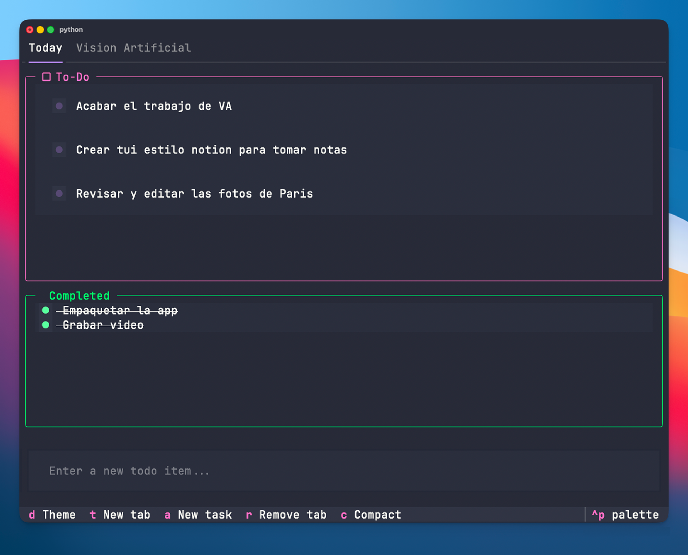

# Terminal Todo

A beautiful, keyboard-driven terminal-based todo application built with [Textual](https://textual.textualize.io/).

  
 

## Features

- 📋 Multiple tabs for organizing tasks
- ✅ Mark tasks as complete/incomplete
- 🎨 Dark/Light theme toggle
- ⌨️ Vim-style keyboard navigation
- 💾 Persistent storage
- 🎯 Compact mode for cleaner view

## Installation

### Recommended: Using pipx (macOS/Linux)

`pipx` is the recommended way to install CLI applications in isolated environments.

```bash
# 1. Install Homebrew (if not already installed)
/bin/bash -c "$(curl -fsSL https://raw.githubusercontent.com/Homebrew/install/HEAD/install.sh)"

# 2. Install pipx
brew install pipx
pipx ensurepath

# 3. Install terminal-todo
pipx install git+https://github.com/marcodiazz/terminal-todo.git
```

### Alternative: From source (for development)

```bash
git clone https://github.com/marcodiazz/terminal-todo.git
cd terminal-todo
pip install -e .
```

### Alternative: Using pip with virtual environment

```bash
python3 -m venv ~/venvs/terminal-todo
source ~/venvs/terminal-todo/bin/activate
pip install git+https://github.com/marcodiazz/terminal-todo.git
```

## Usage

Simply run:

```bash
todo
```

## Keyboard Shortcuts

- `a` - Add new task
- `t` - Create new tab
- `r` - Remove current tab
- `q` - Delete selected task
- `d` - Toggle dark/light theme
- `c` - Toggle compact mode
- `h/l` or `←/→` - Navigate between tabs
- `j/k` or `↑/↓` - Navigate between tasks
- `Space` - Toggle task completion
- `Esc` - Close modal or unfocus input

## Data Storage

Tasks are automatically saved to `~/.terminal-todo/data.json`

## License

MIT
